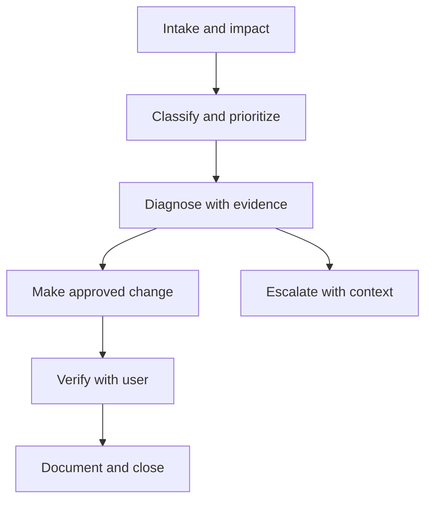

# IT Service Desk Operations Playbook

[](https://github.com/ramphalharrilal/it-support-documentation/actions/workflows/validate.yml)
[](automation/windows/README.md)
[](LICENSE)

A privacy-safe service-desk portfolio showing how I triage incidents, protect users, document decisions, automate read-only diagnostics, manage change risk, and hand work to the right team.

The focus is not a list of commands. It is the complete support process: understand the business impact, gather reliable evidence, make the smallest safe change, verify recovery with the user, and leave a useful record behind.

## Portfolio Map

| Capability | Evidence in this repository |
| --- | --- |
| Support operations | [Service Desk Operating Model](operations/service-desk-operating-model.md) |
| Incident investigation | [Microsoft 365 Access Case](case-studies/microsoft-365-access-incident.md) and [DNS Resolution Case](case-studies/dns-resolution-incident.md) |
| Windows automation | [System Health Collector](automation/windows/README.md) |
| Ticket quality | [Incident Ticket](templates/incident-ticket.md), [Change Record](templates/change-record.md), and [Escalation Record](escalation/ticket-escalation-template.md) |
| Windows and networking | [Windows Connectivity Troubleshooting](troubleshooting/windows-connectivity-troubleshooting.md) |
| Microsoft 365 | [Microsoft 365 Sign-In Troubleshooting](microsoft-365/m365-sign-in-troubleshooting.md) |
| User lifecycle | [New User Onboarding Checklist](onboarding/new-user-onboarding-checklist.md) |
| Security response | [Phishing First Response](security/phishing-first-response.md) |
| Change and recovery | [WordPress Safe Update and Rollback](websites/wordpress-safe-update-and-rollback.md) |
| Endpoint and peripherals | [Printer Troubleshooting](printers/printer-troubleshooting.md) |

## Operating Workflow



## What Makes This Operational

- An impact-and-urgency model separates inconvenience from a business-critical incident.
- Ticket templates capture timestamps, evidence, actions, approvals, rollback, and user communication.
- Case studies show hypotheses, decision points, command output interpretation, resolution, and closure notes.
- The PowerShell collector gathers read-only Windows health evidence without collecting passwords, Wi-Fi profiles, browser data, or message contents.
- Automated validation checks internal links, required portfolio artifacts, obvious placeholders, and common secret patterns on every pull request.

## Repository Structure

```text
automation/       Read-only diagnostic tooling and usage guidance
case-studies/     Fictional but realistic incident investigations
operations/       Triage, priority, communication, and escalation model
templates/        Reusable incident and change records
troubleshooting/  Technical support procedures
security/         First-response security guidance
scripts/          Repository quality validation
```

## Run the Windows Health Collector

The collector is designed for an authorized support session on Windows PowerShell 5.1+ or PowerShell 7+.

```powershell
.\automation\windows\Collect-SystemHealth.ps1
```

Network addressing is excluded by default. Add it only when the ticket requires it and policy allows it:

```powershell
.\automation\windows\Collect-SystemHealth.ps1 -IncludeNetworkDetails
```

Review and redact the generated local JSON file before attaching it to a ticket. See the [tool documentation](automation/windows/README.md) for scope and safety controls.

## Validate the Repository

The validator uses only the Python standard library.

```bash
python scripts/validate_repository.py
```

## Documentation Standard

Every support procedure should answer six questions:

1. What is the user trying to do?
2. What is the scope and business impact?
3. What evidence supports the working diagnosis?
4. Is the proposed action authorized, reversible, and proportionate?
5. How will recovery be verified?
6. What must the next technician know without repeating the investigation?

## Portfolio and Privacy Notice

All scenarios, identifiers, users, domains, timestamps, and technical values in this repository are fictional or generalized. The repository contains no employer logs, customer data, credentials, tenant details, internal addresses, or production configuration. Workplace policies and authorized escalation paths always take priority.

Built by [Ramphal Harrilal](https://ramphalharrilal.github.io/).
